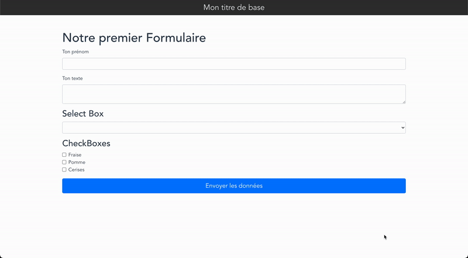

# Formation Udemy - Vue.js de A à Z

## Objectif

Apprenez pas à pas les piliers du framework VueJS : il est très apprécié de tous, plus simple à apprendre que les autres frameworks, moins prise de tête, et sa communauté est top !

## Cours

Pour de plus amples informations, retrouvez le [cours complet](https://www.udemy.com/course/vuejs-de-a-a-z/ "Vue.js de A à Z") sur le site d'Udemy.

### Ressources

[Code source](https://codesandbox.io/s/modale-vuejs-cgow8 "Fenêtre modale Vue.js") de la Section 3, chapitre 40

### Aperçu

    Section 3, chapitre 40 — Fenêtre modale

    Section 3, chapitre 41 - Appel d'API

    Section 4 — Formulaire

    Section 5 — To-Do Liste

    Section 6, chapitre 54 — Système de blog

    Section 7 — App Météo

## Udemy

La première place de marché internationale pour l'apprentissage et la formation ! Ce site permet à des participants situés dans n'importe quel pays de bénéficier de la meilleure formation au monde.

